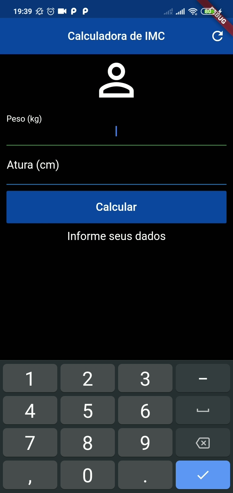
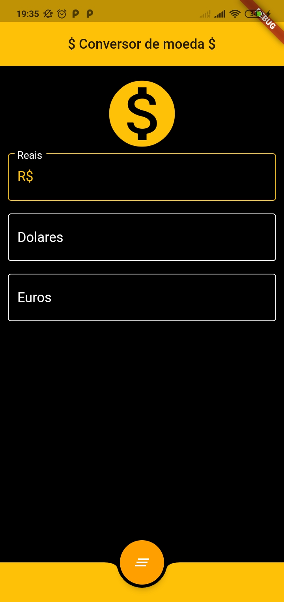

<h2 align="center">
  App Simples Desenvolvidos com Flutter :iphone:
</h2>

---

  <a href="#octocat-sobre-o-repositorio">Sobre esse repositorio </a> &nbsp;&nbsp;&nbsp;|&nbsp;&nbsp;&nbsp;<a href="#milky_way-projetos">Projetos </a> &nbsp;&nbsp;|&nbsp;&nbsp;
  <a href="#memo-licença">Licença</a>&nbsp;&nbsp; 

---

## :octocat: Sobre o repositorio

## :vertical_traffic_light: Projetos
  - <a href="#bmi-calculator">BMI Calculator</a>
  - <a href="#currency-conversion">Currency Conversion</a>
  - <a href="#phonebook">Phonebook</a>
  - <a href="#Search-gifs">Search Gifs</a>
---

- ### BMI Calculator
  App pra calcular o IMC - indice de massa corporal - de uma pessoa. O índice de massa corporal é uma medida internacional usada para calcular se uma pessoa está no peso ideal.

  O objetivo da criação desse projeto/App é o aprendizado basico de alguns conseitos/widgets do flutter, tais como:

    - [x] Scaffold e AppBar
    - [x] TextField e Decoration
    - [x] ScrollView e RaisedButton
    - [x] Controller
    - [x] Formulários e Validações.
 
  

    
    
    &nbsp; &nbsp; &nbsp; &nbsp; &nbsp;
    

  
 
---

- ### Currency Conversion
  Aplicativo simples para a realização de conversão de moedas (Reais, Dólar e Euro), utilizando uma API externa para a obtenção de valores em tempo real.

  Alguns conseitos utilizado neste projeto foram:
  - [x] Padrão JSON
  - [x] API externa e Requisições http
  - [x] FutureBuilder

  

    
    
    &nbsp; &nbsp; &nbsp; &nbsp; &nbsp;
    

  

---
- ### Phonebook

  

    
    
    

  

---
- ### Search Gifs

  

    
    
  

